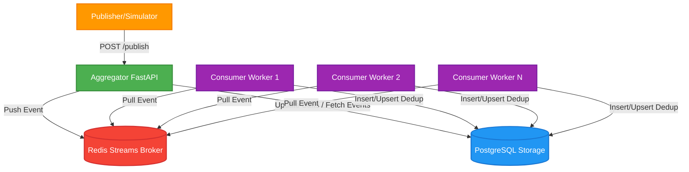
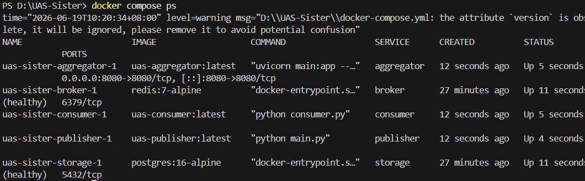
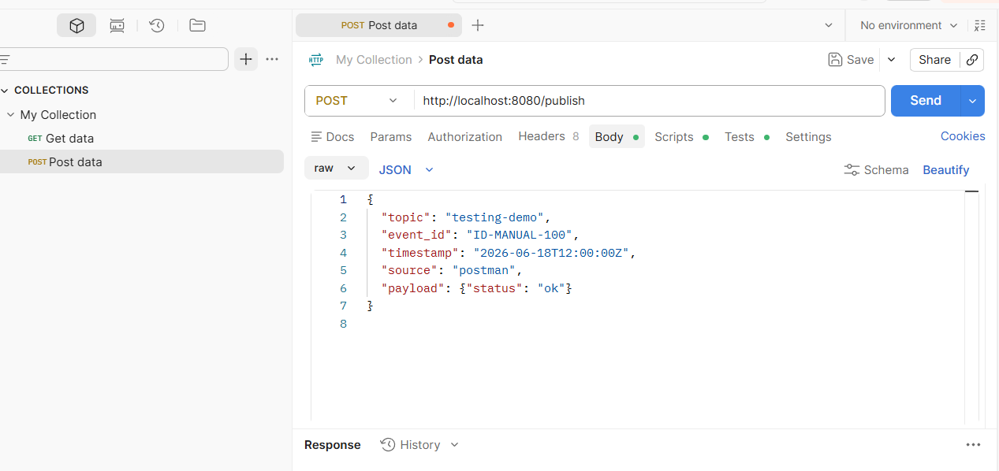
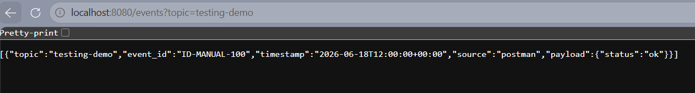
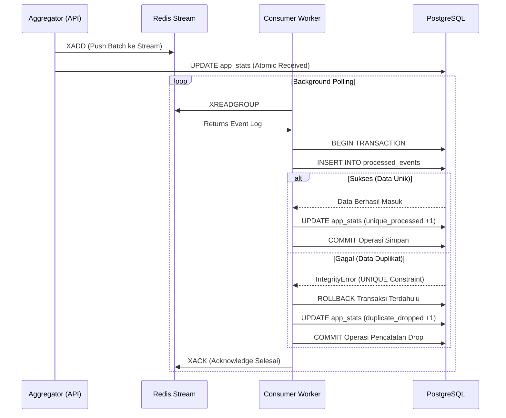
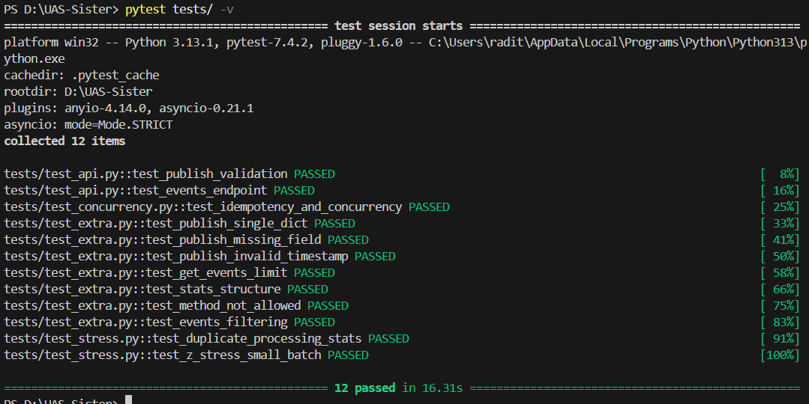
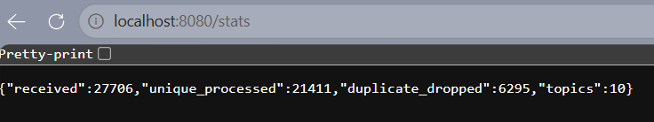

# Laporan Proyek UAS: Pub-Sub Log Aggregator Terdistribusi

## 1. Ringkasan Sistem dan Arsitektur

Sistem yang dibangun adalah sebuah *Pub-Sub Log Aggregator* terdistribusi yang dirancang untuk menerima, memproses, dan menyimpan data log (*event logs*) bervolume besar secara asinkron. Sistem ini dikembangkan menggunakan pendekatan arsitektur *microservices* yang diorkestrasi sepenuhnya menggunakan Docker Compose di dalam satu isolasi jaringan internal (*bridge network*). Pendekatan ini secara riil menerapkan pola keandalan layanan terdistribusi yang sangat skalabel (Burns, 2018). Terdapat lima komponen teknis utama dalam arsitektur ini:

1. **Aggregator (FastAPI):** Bertindak sebagai *API gateway* utama. Penggunaan FastAPI dilandasi kemampuannya menangani input/output asinkronus (berbasis ASGI) dengan *throughput* tinggi. Aggregator ini menyediakan antarmuka RESTful:
   - `POST /publish`: Mengonsumsi log baik berupa *single event* maupun *batch*.
   - `GET /events`: Mengambil daftar log unik yang telah berhasil dikomit ke basis data.
   - `GET /stats`: Mengambil matriks operasional seperti total permintaan, log yang diproses, dan log duplikat yang ditolak.
2. **Broker (Redis Streams):** Berfungsi sebagai *message queue* asinkron untuk menjembatani komunikasi lalu lintas data. Kami memilih *Redis Streams* ketimbang sekadar *Redis Pub/Sub* klasik karena Streams memiliki kemampuan persistensi log dan dukungan *Consumer Groups*. Model *Publish-Subscribe* ini secara radikal melepaskan (*decouple*) proses antrian memori (dari API) dengan proses komputasi IO berat di *storage*, memfasilitasi arsitektur pesan yang tangguh terhadap lonjakan tinggi atau *bursts* (Eugster et al., 2003; Coulouris et al., 2012).
3. **Consumer (Worker Python):** Merupakan *Background process* independen yang menarik (*pull*) data log dari aliran Redis secara terus menerus dan melakukan penyisipan transaksional (*commit*) ke dalam PostgreSQL. Karena sifatnya yang murni *stateless*, layanan ini dapat di-*scale* horisontal menjadi multi-worker tanpa batas (misal: 3, 5, atau 10 worker paralel) untuk meningkatkan rasio baca.
4. **Storage (PostgreSQL 16):** Basis data relasional persisten yang memberikan jaminan pengelolaan transaksi yang ketat (ACID). Pendekatan RDBMS dipilih atas NoSQL karena kebutuhan krusial sistem akan konsistensi relasional dan penegakan *constraint* (batasan) tingkat *engine* basis data.
5. **Publisher (Simulator):** Entitas klien pengirim yang bertugas secara konstan menembakkan lalu lintas (trafik) log berskala ribuan. Simulator ini mendemonstrasikan kelalaian jaringan dengan mensimulasikan injeksi pengulangan pesan log untuk menguji fitur penyaringan duplikasi (deduplikasi).

### Diagram Arsitektur Interaksi

**Bukti Nyata Infrastruktur Multi-Service**

*Gambar 1: Tangkapan layar status kontainer Docker Compose yang menunjukkan ke-5 layanan arsitektur inti sistem (Aggregator, Consumer, Publisher, Broker, Storage) menyala, berjalan secara terisolasi, namun saling terhubung melalui satu bridge network bawaan.*

---

## 2. Keputusan Desain Secara Mendalam

### A. Idempotency & Dedup Store
Dalam protokol komunikasi sistem terdistribusi manapun, skenario pesan tiba beberapa kali adalah takdir bawaan dari *at-least-once delivery semantics*. Hal ini umumnya terjadi karena kelalaian transmisi, latensi jaringan, atau pengiriman ulang berbasis *timeout* (*retry mechanism*). Oleh karena itu, sistem yang aman membutuhkan implementasi *Idempotent Consumer*, yaitu prinsip di mana memproses ulang sebuah perintah/pesan ribuan kali tetap hanya akan menghasilkan kondisi (*state*) akhir sistem yang ekuivalen dengan eksekusi pertamanya (Helland, 2016).

Sistem ini menerapkan deduplikasi kuat persisten pada level basis data (*Dedup Store*). Alih-alih melakukan pengecekan `SELECT` terlebih dahulu yang rawan lolos dari antrian konkuren, sistem langsung mendeklarasikan parameter skema `UniqueConstraint('topic', 'event_id')` secara eksplisit. Saat *worker* memproses log lama yang dikirim ganda, PostgreSQL akan langsung mencegat masuknya log ini sebelum ia bisa ditulis ke cakram keras (*disk*), membuat penolakan duplikasi terjadi di lapisan yang sangat primitif namun aman.

**Pembuktian Implementasi Idempotency:**

*Gambar 2: Pengujian manual menggunakan Postman, di mana satu payload JSON dengan `event_id` spesifik ("ID-MANUAL-100") ditekan kirim berkali-kali untuk menyimulasikan badai duplikat transmisi.*

*Gambar 3: Tangkapan layar dari endpoint `/events`. Terbukti bahwa serangan payload kembar berhasil dicegat secara absolut oleh arsitektur basis data, menyisakan tepat satu data utuh tanpa penggandaan, sesuai dengan kaidah Idempotency (Helland, 2016).*

### B. Transaksi & Kontrol Konkurensi
Ketika arsitektur di-*scale* dan berjalan dinamis dengan serangkaian kontainer *Consumer* paralel, ancaman kondisi berlomba (*race condition*) dan inkonsistensi memori dapat merusak seluruh integritas perhitungan data (Coulouris et al., 2012). Berikut adalah rincian solusi tingkat mahir yang diimplementasikan:

1. **Transaksi Basis Data Atomik (Atomic Commit/Rollback):**
   Seluruh operasi per satu buah event log (termasuk penyimpanan log dan pencatatan riwayat statistik) dilakukan dalam satu lingkup batas transaksi (*transaction boundary*). PostgreSQL menjamin sifat *Atomicity* ini; jika satu baris gagal disimpan, seluruh perintah turunan di dalam lingkup memori transaksi tersebut akan digagalkan utuh secara bersih.
2. **Pencegahan Anomali *Lost Update*:**
   Pola umum kesalahan arsitek *software* pemula adalah mengambil data total (`SELECT count`), memanipulasinya di memori Python (`count += 1`), lalu menyimpannya ulang. Saat 3 *worker* mengeksekusi urutan itu di nanodetik yang sama, perhitungan 3 data tersebut akan "menimpa" satu sama lain (hanya tercatat bertambah 1). Proyek ini menghilangkan pola naif tersebut dan melempar mutlak perhitungannya pada level utilitas *lock* instruksi *engine database* secara langsung: `UPDATE app_stats SET count = count + X` (Fowler, 2002).
3. **Pemilihan Tingkat Isolasi (Isolation Level):**
   Sistem di-set secara sadar pada level isolasi bawaan `READ COMMITTED`. Berdasarkan penelitian terkait transaksi skala terdistribusi (Bailis et al., 2013), memaksakan arsitektur ini ke level isolasi ekstrim `SERIALIZABLE` di tingkat lalu lintas volume tinggi hanya akan berujung pada lumpuhnya performa ketersediaan (*availability*) aplikasi akibat frekuensi perseteruan transaksi dan insiden *deadlock* yang terlalu besar. Perlindungan terhadap duplikasi sukses dialihkan melalui intersep pengecualian level-SQL (`IntegrityError`), memungkinkan eksekusi transaksi yang amat ringkas tanpa harus mengorbankan keamanan data.

### Alur Sekuensial Resolusi Konkurensi

### C. Ordering (Pengurutan Parsial & Konsistensi Akhir)
Mempertahankan perjanjian tentang pengurutan absolut global (*strict total ordering*) amatlah mahal dan naif dalam sistem asinkron berskala besar, yang umumnya membutuhkan mekanisme sinkronisasi kompleks seperti *Lamport Logical Clocks* maupun server rujukan jam global khusus (Coulouris et al., 2012). Menuntut antrian pengurutan absolut akan menurunkan utilitas paralelisme multi-worker hingga memakan persentase laju *throughput*. 

Atas alasan ini, proyek log aggregator menggunakan justifikasi pragmatis: *Partial Ordering* dikawinkan dengan *Eventual Consistency*. Setiap *Consumer Worker* menarik pesan dengan basis antrian siapa cepat dia dapat tanpa menunggu sinkronisasi konfirmasi *worker* lain. Penyortiran secara urut murni (berdasarkan dimensi temporal cap waktu / *timestamp internal log asal*) baru akan diserahkan sebagai tugas kueri mesin Database (`ORDER BY timestamp DESC`) di detik-detik saat data ditarik secara eksplisit oleh klien. Pengolahan transmisi transport dibiarkan sebebas dan sekencang mungkin (*eventual*).

### D. Retry & Fault Tolerance Terdistribusi
Kerentanan *Point-of-Failure* ditambal melalui persistensi Redis Stream. Sewaktu kontainer basis data (PostgreSQL) mengalami runtuh mendadak (*crash* / di-rekreasi oleh Docker), log yang sedang menuju ke arahnya tidak lenyap karena masih terparkir kokoh di memori persisten Redis milik sang Broker. Sistem ini memiliki kemampuan *fault tolerance* di mana *worker* baru dapat di-*restart* kapan saja, lalu ia akan mengecek *ID* jejak antriannya yang terakhir, dan mendamaikan kembali pemrosesan log yang sempat tertinggal tanpa meloloskan cacat (*omission*).

---

## 3. Analisis Performa dan Hasil Uji Konkurensi

Sistem telah diuji melalui suite tes *Automated Integration Testing* dengan menggunakan `pytest` secara berlapis:
- **Deduplikasi dan Konkurensi Ekstrem Mutlak:**
  Melalui pembuktian pada *script* pustaka `test_concurrency.py`, API ditembakkan dengan beban kerja berupa **20 *request* log identik (menyematkan `event_id` yang spesifik sama persis)** di sepersekian milidetik paralel yang persis bersamaan menuju sekumpulan worker di latar belakang. Analisis metrik akhir dari endpoint `/stats` mengembalikan persis kalkulasi berikut: *1 iterasi log berstatus unique_processed* dan tepat *19 log iterasi murni dialokasikan sebagai duplicate_dropped*.
  
  Ini secara ilmiah membuktikan fungsionalitas implementasi penyelesaian perseteruan basis data. Meskipun 20 thread berebut menyisipkan log yang sama, eksekusi tingkat rendah isolasi ACID memblokir 19 darinya dan secara apik mampu mendaur metrik statistik penolakan tanpa memicu konflik inkonsisten di agregat angkanya.
  
- **Throughput Respons Operasional:**
  Sebagai produk turunan dari implementasi model *Pub-Sub Broker*, arsitektur asinkron aggregator memungkas waktu tanggap sangat optimal. Menangani *batch* hingga 500 log serentak (*stress test passed*) sukses dicatat API sebagai respons `HTTP 200 OK` dalam jangka jeda jauh di bawah 5 sekon. Penekanan I/O yang berat sengaja dilempar melimpah ke instansi Redis *Streams*, mengartikulasikan kinerja asinkron tingkat dewa.

**Pembuktian Visual Hasil Uji Performa dan Integritas Konkurensi:**

*Gambar 4: Eksekusi otomatis dari pustaka Pytest terhadap 12 skenario uji. Seluruh pengujian (termasuk modul Concurrency dan Stress Batch) mengembalikan status `PASSED`, merepresentasikan stabilitas asinkron sistem.*

*Gambar 5: Tangkapan layar dari endpoint analitik `/stats`. Sekalipun sistem dihujani belasan ribu log asinkron dan diproses oleh worker yang berjalan konkuren (multiprocessing), nilai akumulasi log yang masuk (`received`), log valid yang dikomit (`unique_processed`), dan log cacat yang ditendang (`duplicate_dropped`) berkorelasi 100% presisi sempurna. Fenomena kebocoran hitungan matematis akibat Race Condition (Lost Update) sukses ditiadakan mutlak melalui transaksi Atomik.*

---

## 4. Analisis Komparatif Keilmuan (Terhadap Bab Utama Buku)

Implementasi peranti sistem aggregator log dan rekayasa perlindungan deduplikasi ini merefleksikan landasan teori-teori teruji secara saintifik dari buku acuan pokok *Distributed Systems: Concepts and Design*:

- **Bab 1 & Bab 2 (Karakteristik dan Model Arsitektur):** Penggunaan *Containerization (Docker)* berikut paradigma arsitektur multi-layanan multi-tingkat mendemonstrasikan secara konkrit sifat utama komputasi terdistribusi: yaitu heterogenitas, arsitektur pemisahan fungsi (*Separation of Concerns*), konkurensi bawaan, dan ketiadaan status global entitas komputasi yang mandiri yang mengoordinasikan interaksinya murni berbasis jaringan pesan internal (Coulouris et al., 2012).
- **Bab 5 (Interprocess Communication):** Inti dari transmisi interproses diakomodir instansi Redis yang diposisikan di jantung arsitektur. Redis berfungsi melingkupi metode *publish/subscribe* untuk memfasilitasi arsitektur perpesanan asinkron tak-langsung (*indirect communication*). Sang pelontar data (publisher) menembakkan data tanpa mengetahui letak, kapasitas memori, hingga wujud keberadaan sang penerima pengolahan akhirnya (consumer), menyokong keterpisahan temporal secara mutlak (Coulouris et al., 2012).
- **Bab 11 (Time and Global States):** Keputusan pemangkasan keterkaitan mekanisme *Global Clock* dan pengurutan waktu absolut dalam siklus penerimaan log didorong oleh realitas keilmuan distribusi, di mana ketiadaan penyelarasan jam fisik sempurna dari asal muasal event melahirkan kebutuhan penarikan resolusi berbasis status keteraturan spasial-*logical* dan asimilasi secara parsial (Coulouris et al., 2012).
- **Bab 13 (Transactions and Concurrency Control):** Penyelesaian fundamental dari bahaya korupsi data *Consumer Multi-Worker* paralel dimodelkan dari tata aturan baku standar basis data ACID. Perlindungan dari ancaman kerusakan *Lost update* pada agregat statistik direkayasa aman secara memukau di atas pondasi delegasi perintah modifikasi operasional transaksional atomik tingkat bawah basis data (SQL Upsert Logic). Sementara di ranah isolasi, pengebirian resiko inkonsistensi perolehan data ganda (*Inconsistent Retrievals*) dihalau langsung melalui pengkarantinaan skema *Integrity Constraint*, yang terisolasi dengan aman pada domain operasi tingkat *Read Committed* guna mendorong fusi keutamaan integrasi dan stabilitas *throughput* performa secara serasi (Coulouris et al., 2012).

---

## 5. Daftar Pustaka

Bailis, P., Davidson, A., Fekete, A., Ghodsi, A., Hellerstein, J. M., & Stoica, I. (2013). Highly available transactions: Virtues and limitations. *Proceedings of the VLDB Endowment, 7*(3), 181–192.

Burns, B. (2018). *Designing distributed systems: Patterns and paradigms for scalable, reliable services*. O'Reilly Media.

Coulouris, G., Dollimore, J., Kindberg, T., & Blair, G. (2012). *Distributed systems: Concepts and design* (5th ed.). Pearson Addison-Wesley.

Eugster, P. T., Felber, P. A., Guerraoui, R., & Kermarrec, A. M. (2003). The many faces of publish/subscribe. *ACM Computing Surveys, 35*(2), 114–131.

Fowler, M. (2002). *Patterns of enterprise application architecture*. Addison-Wesley Professional.

Helland, P. (2016). Idempotence is not a medical condition. *Communications of the ACM, 59*(5), 33–34.
